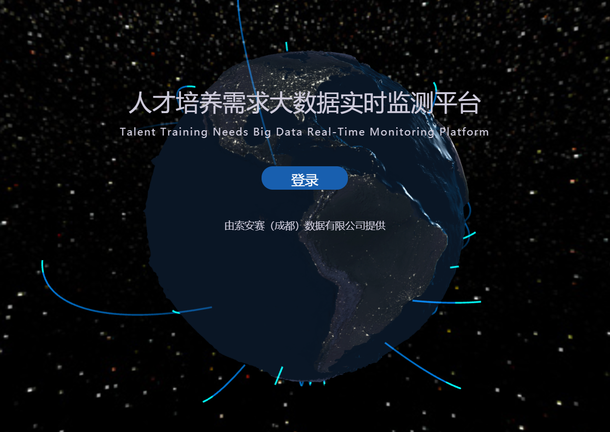
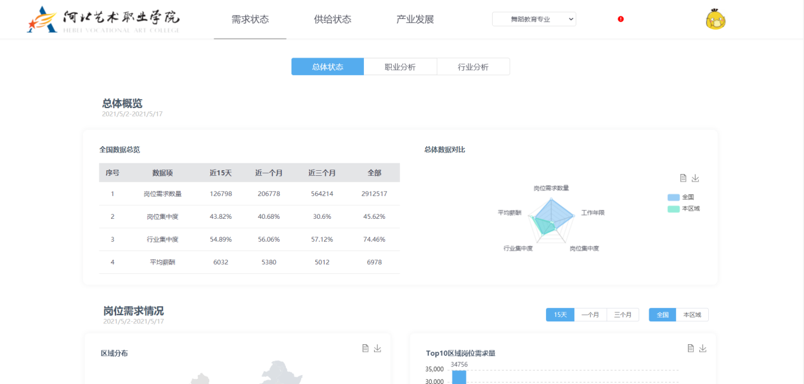
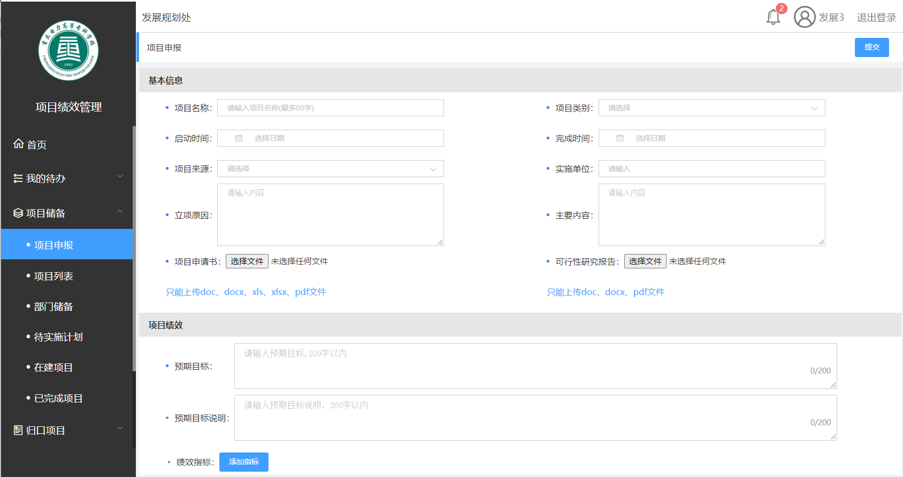

# 冷远强的简历

### 最近工作内容：  
- 负责组织人员进行产品开发  
- 基于teambition进行开发进度管理  
- 协助部门负责人完成公司的数据产品研究和产品转化，与其他部门对接需求  
- 负责公司一部分数据采集  

### 会的一些东西：  
> 后端主要掌握语言python，前端掌握vue、vuex, jquery的话很少写，一般就是基于element-ui的栅格布局写一些东西，加上媒体查询的话能适应大部分页面，要求不大的话, 再加上uni-app的话可以满足一般apk使用需求（apk的话，一般基本的GPS定位，相机，还有一些基本的安卓调用等等是没问题的）  

- ### 后端：  
1. 写脚本的话一般会用到一些基于协程的，消息队列的  
2. 写网站的话，一般就用django框架，简单接口用flask，请求稍微多一点会用到tornado，异步任务就用celery
3. 数据库，常用的是mysql, mongodb, redis;mysql的话主要就是配置过读写分离和分库分表还有些常用操作；mongodb，主要还是用来缓存爬虫的数据，相当于做一次中转，后面通过一些处理再放到mysql里面
4. 部署， 熟悉ubuntu16.04 和centos7.2以上，其他linux系统不太熟悉，shell编程边查边弄没有问题；docker的话，一般命令还可以，编排的很少用语法记不清，但是不是问题
- ### 前端：
1. 原来用的django的templates，后来晚上没事学习了vue, 公司也正好要做一些网站，后面主要是用的vue
2. 用echarts做过图表，css用过stylus, 主要是为了配置统一主题
3. Uni-app做过安卓apk，webview, android studio调试等
4. 其他就看看作品截图吧  

- ### 爬虫：  
一般用scrapy+redis一套能解决大部分需求, 基本上很多爬虫都会用到redis,主要是为了去重的持久化，还有多台机器，去重用的布隆过滤器，能节约很大一部分内存；反爬得话，一般的能绕过，复杂的也没深入研究过，能处理简单js逆向，app的http和https抓包也经常使用，app上有些数据必须要做hook的或者比较麻烦的有时候会用airtest模拟来取，代理的话是基于vps拨号服务器搭建的代理池， 效果确实比免费ip好用

- ### 项目截图

- ### 部分作品展示：
#### 人才需求大数据平台

#### 项目绩效平台

#### 巡检工具app

#### 巡检工具pc

  

>  ### 联系我
> wechat:LYQ895047059
